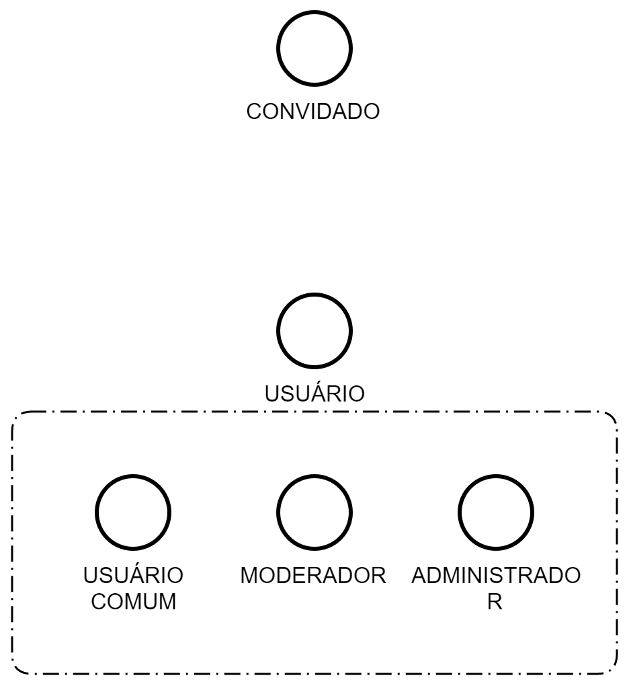

# Apresentação Global do Projeto

Plataforma Social Moderada para Disseminação de Informações sobre Saúde

## Objetivos

O projeto CodeLab-Unifesp desenvolve uma plataforma de comunicação e interação social para que a organização social IBEAC - Instituto Brasileiro de Estudos e Apoio Comunitário Queiróz Filho dissemine informações de saúde a gestantes e puérperas das comunidades da região de Parelheiros em São Paulo. A ideia, formatada a partir de várias reuniões com representantes da ONG, é desenvolver um aplicativo de fórum de discussão que criará uma ponte entre especialistas em primeira infância do CEPI (Centro de Estudos em Primeira Infância) e as mães e puérperas. Entre os tópicos do aplicativo estão os cuidados com as mães, o parto e os bebês, além de trocas solidárias e indicações de cultura e lazer. O projeto tem potencial de atingir um grande número de pessoas da comunidade, visto que a ONG trabalha com toda a região de Parelheiros e tem atuação e reconhecimento nacionais. O software a ser desenvolvido será de licença livre e poderá ser usado também por outras comunidades.

## Público-alvo

Gestantes, mães e especialistas.

## Escopo

Existem dificuldades de acesso, principalmente por parte das mães. A plataforma deve ser acessível por computador, dispositivos móveis apple ou android (provavelmente até mesmo versões que não recebem mais atualizações).

## Elementos existentes

A versão atual da plataforma compreende uma api (hospedada no Heroku) e um aplicativo Android (versão mínima 4.4 KitKat). As telas do aplicativo podem ser encontradas no Slack, canal #general. A documentação da api ainda está em construção.

# Descrição Gráfica

## Identidade Visual

O mais próximo de uma identidade visual oficial da plataforma é o app atual () ou o figma (https://www.figma.com/file/2i2QM85xG6yr40kIgpY8vq/IBEAC-Web?node-id=0%3A1).
Por enquanto, a cor principal é a indicada no figma (#31788A), e pode ser referenciada por "primary" dentro da biblioteca chakra-ui.

# Descrição Funcional e Técnica

## Mapa do Site

### Login

CONVIDADO entra com suas credenciais de usuário.
CONVIDADO pode recuperar sua senha (ele/administrador vai receber um email com as novas credenciais).

### Sair

USUÁRIO pode sair da sua conta logada (botão provavelmente vai estar no menu lateral ou na drawer)

### Feed

USUÁRIO visualiza as últimas postagens em duas tabs, INÍCIO (todas as últimas postagens) ou RECOMENDADOS (postagens verificadas por um MODERADOR)
USUÁRIO possui mais tabs, uma pra cada categoria (atualmente esta assim no figma, não na master; se for seguir assim, como fica se for possivel adicionar mais categorias?)

### Novo Postagem

USUÁRIO pode preencher um **formulario** para criar uma nova postagem, especificando titulo, corpo e categoria vinculada

### Postagem

USUARIO pode visualizar o titulo, corpo e categoria de uma postagem
USUARIO pode visualizar todos os comentários feitos por outros USUÁRIO nessa postagem
USUÁRIO pode criar um comentario nessa postagem
MODERADOR pode verificar a postagem (não presente no figma, mas é basicamente um selo de verificado - pensa twitter - onde o MODERADOR pode clicar)

### Formulário Socioeconomico

USUARIO COMUM pode preencher um formulario com informações pessoais, em especifico:
 - Nome completo do representante da familia (sem abreviações)
 - Quantas pessoas tem na família
 - Quantas crianças pequenas (0 a 6 anos) tem na família?
 - Gestante? (Sim ou Não)
 - Quantas mulheres estão gestantes na família?
 - Amamentando? (Sim ou Não)
USUÁRIO COMUM pode visualizar as últimas respostas inseridas no formulário

### Complemento de Dados

USUARIO COMUM pode preencher um formulario para complementar as informações da sua conta:
 - Data de Nascimento
 - Sexo
 - Telefone (De preferência whatsapp)
 - Cor (Etnia)
 - Endereço da família
USUÁRIO COMUM pode visualizar as últimas respostas inseridas no formulário

### Cadastro de Novos Usuários

(não existe no figma)
ADMINISTRADOR pode preencher um formulário para cadastras novos usuários:
 - Nome Completo (obrigatorio)
 - E-mail
 - Senha Temporária (gerar automaticamente uma senha ao carregar a tela)
 - Bairro (dropdown de opções fixas)
 - Tipo de Usuário (COMUM, MODERADOR, ADMINISTRADOR)

### (FUTURE) Meu Perfil

(não existe no figma)
USUARIO COMUM pode alterar dados do perfil dele, como:
 - Nome Completo
 - Email
 - Bairro
 - Senha (com confirmação de senha para alteracao)
(avaliar a possibilidade de mesclar com **Complemento de Dados**)
(avaliar impacto na alteração do bairro para postagens já feitas pelo usuário)

### (FUTURE) Usuários

(não existe no figma)
MODERADOR/ADMINISTRADOR pode ver uma lista com todos os usuários
MODERADOR/ADMINISTRADOR pode clicar em um usuário para ver mais informações sobre o usuario
ADMINISTRADOR pode alterar as informações de um usuário
(administrador deveria poder alterar **Complemento de Dados** ou **Formulário Socioeconomico** por aqui)

### (FUTURE) Notificações

(não existe no figma)
USUÁRIO pode determinar de quais tipos de postagens ele quer receber notificações

# Conexões

## Contas do Google

## Heroku

### Banco de Dados

### API

### Web
